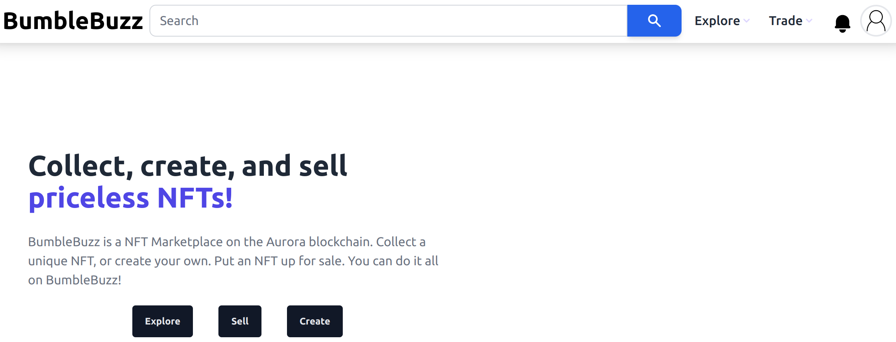

# BumbleBuzz

BumbleBuzz is a NFT marketplace which focuses on empowering artists and creators. Our vision here is to build upon the tried-and-tested marketplace experience by giving more utility to creators.

lkdflksjflksdflksdj

Creators can migrate their collections on BumbleBuzz and earn commission on sales of their NFTs. Creators also have the ability to get incentives directly from the source, which could be a grant, on-chain incentives, or from their community.

On BumbleBuzz, as a creator you have much more control on how you want to portray your hard work and get rewarded.
